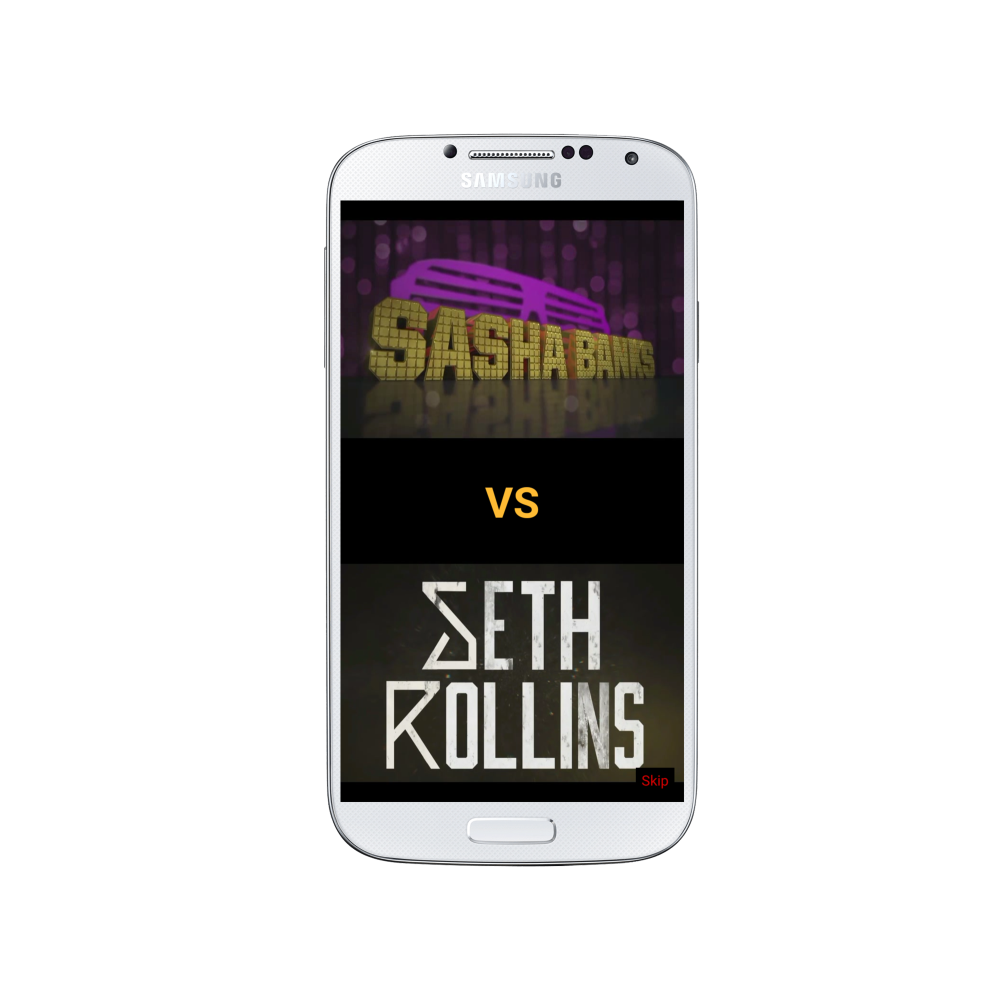

<h1 align="center">
    WWE Tapout
  <br>
</h1>
<h4 align="center">Two Players Agility Fighting WWE Game.</h4>
<br>
<h6 align="center"><a href="https://docs.google.com/uc?export=download&id=0B1Zc1LkGIpxySFg0bHZISkNJYzg"></a></h6>
<p align="center">
  <a href="https://github.com/thegenuinegourav/WWE-Tapout#fork-destination-box">
    . Contribute .
  </a>
  <a href="https://docs.google.com/uc?export=download&id=0B1Zc1LkGIpxySFg0bHZISkNJYzg">
    . Download .
  </a>
  <a href="https://github.com/thegenuinegourav/WWE-Tapout">
    . Demo .
  </a>
</p>
<br>

## About WWE Tapout!

```bash
WWE Tapout is a fighting game built on Android. 

It is designed for 2 players to test their agility, quickness & swiftness using their favourite WWE superstars.

To win, one should break opponent superstar's card as quickly as possible.

Breaking card will involve certain taps & hold according to strength of a superstar.

```

## Download
You can [download](https://docs.google.com/uc?export=download&id=0B1Zc1LkGIpxySFg0bHZISkNJYzg) latest installable version of WWE Tapout for Android.
  
  
## Development  
Want to contribute? **:pencil:**  
  
To fix a bug or enhance an existing module, follow these steps:  
  
1. Fork the repo
2. Create a new branch (`git checkout -b exciting-stuff`)
3. Make the appropriate changes in the files
4. Add changes to reflect the changes made
5. Commit your changes (`git commit -am 'exciting-stuff!!'`)
6. Push to the branch (`git push origin exciting-stuff`)
7. Create a Pull Request  
  
  
## Interested?  
If you find a bug (the website couldn't handle the query and / or gave irrelevant results), kindly open an issue [here](https://github.com/thegenuinegourav/WWE-Tapout/issues/new) by including your search query and the expected result.  
  
If you'd like to request a new functionality, feel free to do so by opening an issue [here](https://github.com/thegenuinegourav/WWE-Tapout/issues/new) including some sample queries and their corresponding results.  
  
  
## Gameplay  
 
 
                                       
 
## License

[WWE](http://www.wwe.com/)

---

> [thegenuinegourav.io](https://thegenuinegourav.github.io/) &nbsp;&middot;&nbsp;
> GitHub [@thegenuinegourav](https://github.com/thegenuinegourav) &nbsp;&middot;&nbsp;
> Youtube [@thegenuinegourav](https://www.youtube.com/channel/UCs8380tHxevj72ffRhbGoUw)
